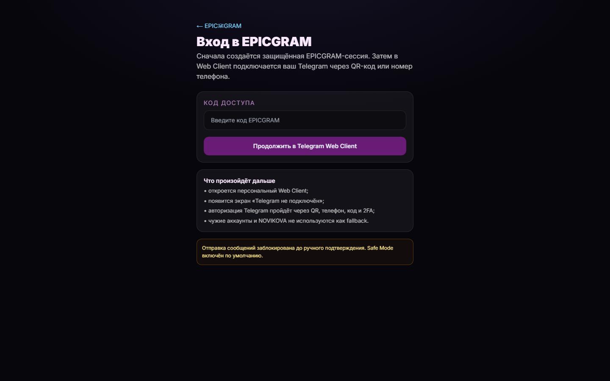
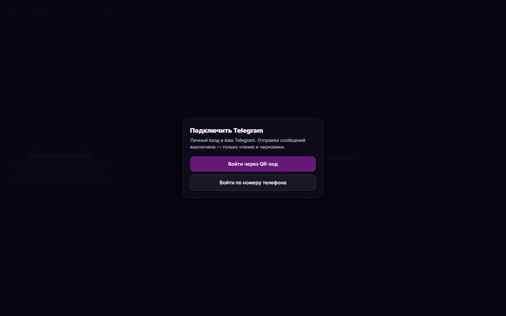
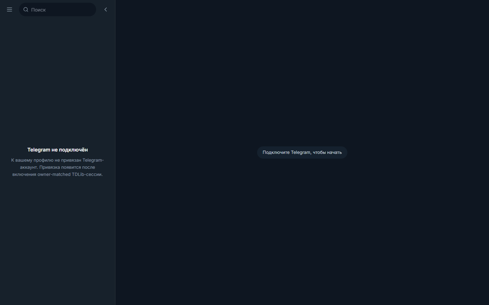
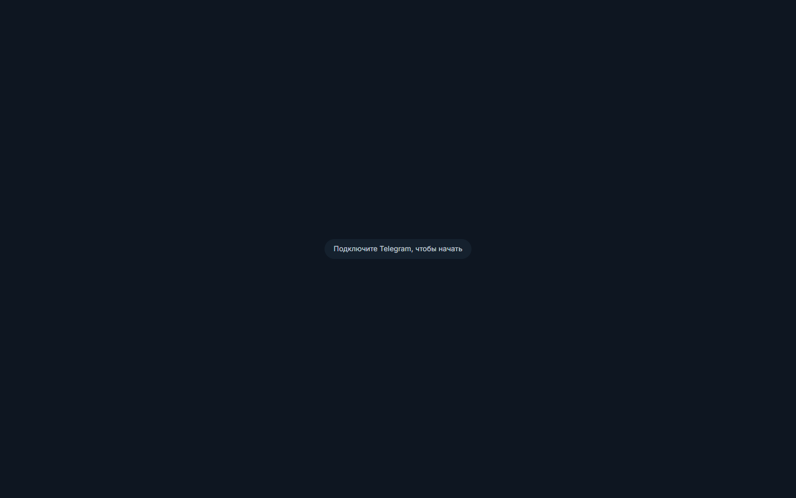
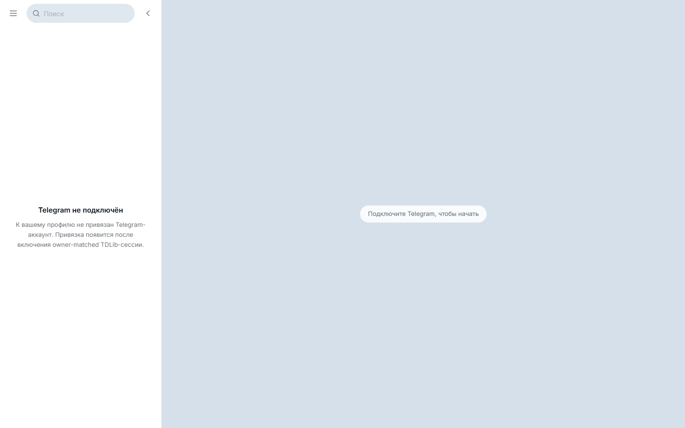

# Telegram-like Web Client (`/client`)

The post-login landing now renders a familiar two-pane Telegram interface
(`components/tg/TgClient.tsx`) instead of the operator "cabinet". All data is
**real-only**, served through the existing `/api/telegram/*` routes — the server
resolves the owner-bound slot, enforces the owner match and the send approval
gate. The browser never talks to Telegram directly and cannot bypass the gate.

## Screenshots

These are captured against the **real API** with an authenticated EPICGRAM
session. Because no owner-matched Telegram binding exists yet (deny-by-default,
see the data gap below), the client honestly shows its empty / connect states —
there is **no mock data anywhere**.

### Login gate

### Client — real "Connect Telegram" flow (auto-shown when no binding)

### Client shell — honest empty state (dark, default theme)

### Collapsible sidebar (dark)

### Light theme (optional)

## Data gap (why the chat list / message feed are empty here)

Populated screenshots require a **bound, authorized Telegram account**. That
depends on the owner-matched binding model (`resolveBoundAccountId` returns
`null` for everyone by design until `P-EPICGRAM-CLIENT-PLATFORM-1` lands it) and
a running TDLib backend at `:8788`. Neither is available on the candidate, so
the client renders honest empty states rather than fabricated chats. The
list/thread/composer rendering (grouping, date separators, bubbles, unread
badges, avatars) is driven purely by the real backend shape from
`services/api/src/tdlib-adapter.mjs` and will populate as soon as a binding is
authorized.
